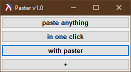

# Paster

Quickly paste items into the clipboard from an easy to resize panel. 
Add an item from the clipboard using the '+' button. 
Remove an item by right-clicking on it. 

## Version History

* v1.1 - added support for reading the initial clips off an optional configuration file;
* v1.0 - initial release.

## Downloads
You can <b>download</b> the latest release for <b>Windows</b> as a portable, standalone executable [HERE](https://github.com/DexterLagan/paster/releases).

## Optional Configuration 

A config file (**paster.conf**) can optionally be provided, and paster will create buttons for each string in it. Passwords can be partially hidden if their config line starts with "* ".

Example:
<pre>
* my-email-pass
some other item
more items
* some-other-sensitive-text
more regular clips
</pre>
